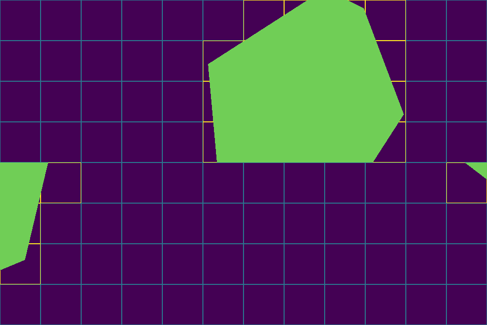

# get_tiles
Script to get the tiles seen in viewport on a tiled spherical video.

# Depends

- matplotlib
- numpy

# Usage
get_tiles.py \[-h\] \[-proj PROJECTION\] \[-fov FOV\] \[-tiling TILING\] \[-coord YAW PITCH ROLL\] \[-out OUTPUT_FILE\]

Optional arguments:
  -h, --help            show this help message and exit
  -proj PROJECTION      The projection \[erp\|cmp\]
  -fov FOV              The Field of View in degree. Ex: 100x90
  -tiling TILING        The tiling of projection. Ex: 3x2.
  -coord YAW PITCH ROLL
                        The center of viewport in degree ex: 15, 25, \-30
  -out OUTPUT_FILE      Save the projection marks to OUTPUT_FILE file.
	
# Example

python get_tiles.py -proj cmp -fov 100x90 -tiling 12x8 -coord 30 -10 -20 -out output.png

Output:  
"[6, 7, 8, 9, 17, 18, 19, 20, 21, 29, 30, 31, 32, 33, 41, 42, 43, 44, 45, 48, 49, 59, 60, 72]"

