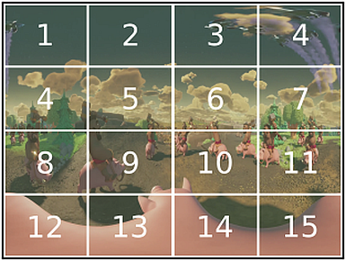
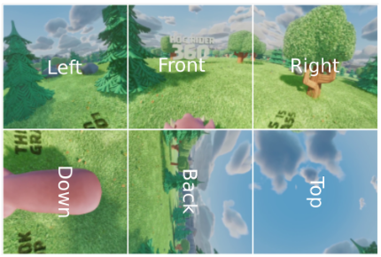
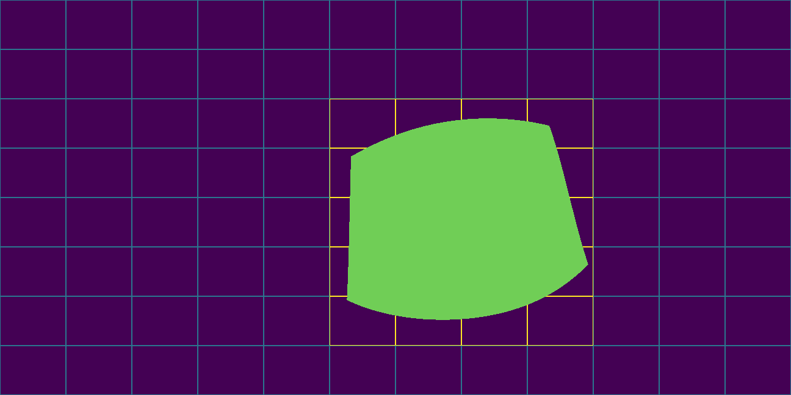
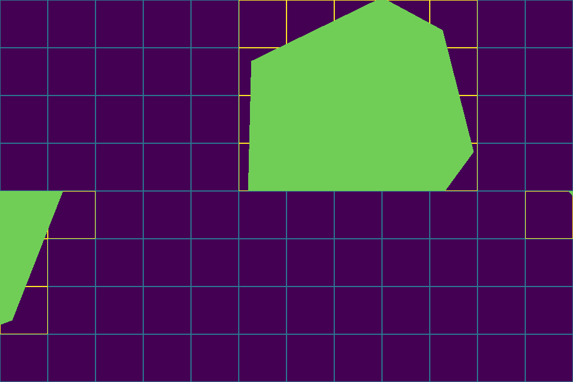

# get_tiles
Script to get the tiles seen in viewport on a tiled spherical video.

The tiling enumeration is done from left to right and from up to down:

The cubemap projection is packed like [MPEG 360lib](https://mpeg.chiariglione.org/standards/exploration/future-video-coding/n17197-algorithm-descriptions-projection-format-conversion) defaults:

# Depends

- matplotlib
- numpy

# Usage
    get_tiles.py [-h] [-proj PROJECTION] [-fov FOV] [-tiling TILING] [-coord YAW PITCH ROLL] [-out OUTPUT_FILE]

Optional arguments:

    -h, --help              Show this help message and exit
    -proj PROJECTION        The projection [erp|cmp]. (Default: "erp")
    -fov FOV                The Field of View in degree (Default: "110x90")
    -tiling TILING          The tiling of projection. (Default: "3x2")
    -coord YAW PITCH ROLL   The center of viewport in degree. (Default: "0 0 0")
    -out OUTPUT_FILE        Save the projection marks to OUTPUT_FILE file.
	
# Example

## ERP

    python get_tiles.py -proj erp -fov 100x90 -tiling 12x8 -coord 30 -10 -10 -out erp_12x8.png

Output:  

    [29, 30, 31, 32, 41, 42, 43, 44, 53, 54, 55, 56, 65, 66, 67, 68, 77, 78, 79, 80]

## CMP

    python get_tiles.py -proj cmp -fov 100x90 -tiling 12x8 -coord 30 -10 -20 -out cmp_12x8.png

Output:  

    [5, 6, 7, 8, 9, 17, 18, 19, 20, 21, 29, 30, 31, 32, 33, 41, 42, 43, 44, 45, 48, 49, 59, 60, 72]

# Limitations

The projection resolution affects script accuracy. So the resolution 
is fixed at "1296x648" for erp and "972x648" for cmp. This allows 
projection tiling by 3x2, 6x4, 9x6 and 12x8 without pixel rounding, i.e. all 
tiles with the same numbers of pixels.
